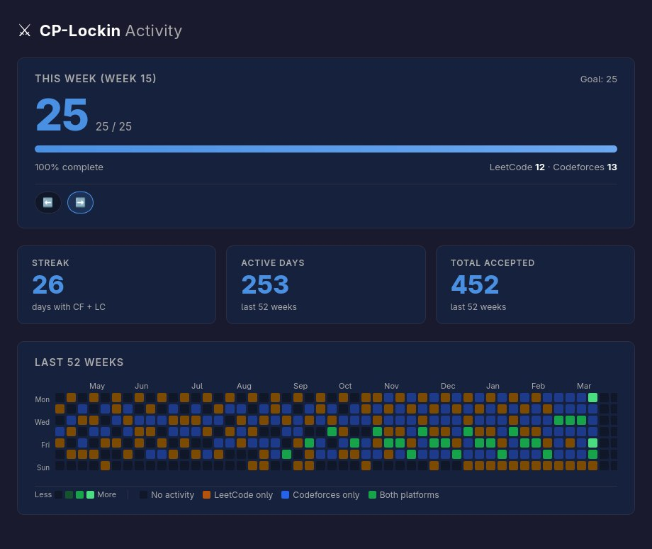

# CP-Lockin

**A privacy-friendly browser extension for competitive programmers who want consistency, not just occasional bursts of motivation.**

CP-Lockin tracks your Codeforces and LeetCode activity, turns it into clear weekly progress and long-term trends, and helps you stay accountable with goals, streaks, and a visual 52-week history.

## Screenshot

### Dashboard




## Features

### Track consistency, not just totals

- See how many problems you solved today across Codeforces and LeetCode.
- Track your current streak to reinforce daily problem-solving habits.
- Set a weekly goal and monitor progress at a glance.
- Use a daily minimum target to make consistency measurable.

### Understand progress over time

- Explore a GitHub-style 52-week heatmap of your activity.
- View active days and total solved across the past year.
- Compare platform contribution with a clear weekly breakdown.
- Switch between current and previous week views to review momentum.

### Built for low friction

- Sync data automatically in the background on a recurring schedule.
- Trigger a manual sync anytime from the popup.
- Configure only your Codeforces handle and LeetCode username.
- Use the extension without creating an account or connecting a backend.

### Privacy-first by default

- All tracked data is stored locally in `browser.storage.local`.
- No external database, hosted backend, or account system is required.
- Your activity stays in your browser profile unless you choose otherwise.

## How It Works

CP-Lockin fetches accepted competitive programming activity from two sources:

- **Codeforces** via the public REST API, using accepted submissions and incremental syncing after the initial fetch.
- **LeetCode** via the public GraphQL `submissionCalendar`, which provides day-level activity used for weekly progress and heatmap visualization.

That raw platform data is normalized into a common local format, stored in browser local storage, and then processed into:

- daily counts
- streak calculations
- weekly goal progress
- yearly activity summaries
- heatmap-ready visualization data

The popup surfaces quick feedback for today, this week, and your current streak, while the dashboard provides the broader 52-week view and historical trends.

## Tech Stack

- **JavaScript** for extension logic and data processing
- **Browser Extension APIs** for storage, messaging, alarms, and background execution
- **Codeforces API** for accepted submission history
- **LeetCode GraphQL** for submission calendar data
- **HTML/CSS** for the popup, options page, and dashboard UI
- **Firefox Manifest V3** extension architecture

## Installation

### Load in Firefox as a temporary add-on

1. Clone or download this repository.
2. Open Firefox and go to `about:debugging`.
3. Select **This Firefox**.
4. Click **Load Temporary Add-on...**
5. Choose the project's `manifest.json` file.
6. Pin the extension if needed, then open `CP-Lockin` from the Firefox toolbar.
7. Open **Settings** and enter your Codeforces handle and/or LeetCode username.
8. Run a sync to populate your activity data.

> No build step is required for local loading. Firefox can load the extension directly from the source tree.

## Usage

1. Open the extension popup from the browser toolbar.
2. Go to **Settings** and add your Codeforces handle, LeetCode username, weekly goal, and daily minimum.
3. Save your settings.
4. Click **Sync** to fetch your latest activity.
5. Review the popup for today's solves, streak, weekly progress, and last sync status.
6. Open the **Dashboard** to inspect the 52-week heatmap, active days, total solved, and weekly platform breakdown.

## Project Structure

```text
CP-Lockin/
├── manifest.json              # Firefox extension manifest
├── src/
│   ├── api/                   # Platform integrations (Codeforces, LeetCode)
│   ├── background/            # Background sync orchestration and messaging
│   ├── config/                # Default settings and shared constants
│   ├── dashboard/             # Full activity dashboard UI and visualization logic
│   ├── options/               # Settings page for handles and goals
│   ├── popup/                 # Compact popup experience for quick status checks
│   ├── services/              # Stats, streak, and weekly aggregation logic
│   ├── storage/               # Local storage access and data lifecycle helpers
│   └── utils/                 # Shared date utilities and helpers
├── icons/                     # Extension icons
└── package.json               # Development scripts
```

## Key Design Decisions

### Local storage instead of a backend

CP-Lockin stores all tracking data in `browser.storage.local` rather than sending it to a server. This keeps the extension simple to install, privacy-friendly by default, and easy to run without authentication or infrastructure.

### Weekly tracking as the primary accountability loop

Daily activity is useful, but weekly progress is a better signal for consistency over time. The extension centers its UI around a configurable weekly goal while still exposing daily streaks and minimum targets for short-term discipline.

### Heatmap-first visualization

A 52-week heatmap makes long-term behavior immediately visible. Rather than showing only raw totals, CP-Lockin emphasizes patterns: active days, inactive gaps, and platform mix over time.

### Platform-based color system

The heatmap distinguishes where activity came from:

- **Gold** for LeetCode-only days
- **Blue** for Codeforces-only days
- **Green** for days with activity on both platforms

This makes cross-platform balance easy to interpret without additional filtering.

## Limitations

- **Codeforces API window**: the initial sync is bounded by the API response size used by the extension, so very large historical accounts may not include every older accepted submission in a single pass.
- **LeetCode data granularity**: the `submissionCalendar` provides day-level accepted submission counts, not a precise list of unique solved problems.
- **LeetCode timezone behavior**: calendar data is aligned to UTC day boundaries, which can shift late-night activity for users in negative UTC offsets.
- **LeetCode session visibility**: the extension does not require app authentication, but some LeetCode calendar visibility can depend on what the site exposes to the browser session.
- **Firefox-focused setup**: the current project is implemented and documented as a Firefox extension loaded through Firefox's temporary add-on flow.

## Future Improvements

- Add export and import for local activity history.
- Support additional competitive programming platforms such as AtCoder.
- Provide richer dashboard filtering by platform and date range.
- Add trend comparisons across multiple weeks and months.
- Improve sync diagnostics with more actionable API error feedback.
- Package and publish a production-ready release build for easier installation.

## Contributing

Contributions are welcome. If you want to improve the extension, open an issue or submit a pull request with a clear description of the problem, the proposed change, and any relevant screenshots or testing notes.

For local development:

```bash
npm install
npm run run
```

Useful scripts:

```bash
npm run lint
npm run build
```

## License

This project is licensed under the **MIT License**.

See [`LICENSE`](LICENSE) for details.

